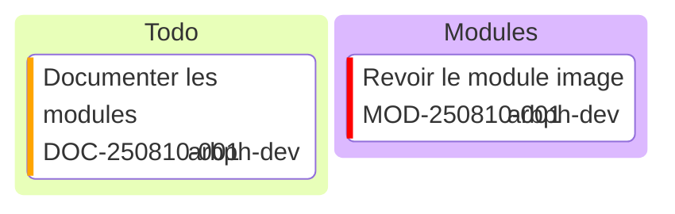

Les graphismes Mermaid sont disponibles
la documentation est accessible ici [Mermaid](https://mermaid.js.org/)

# Kanban
Le kanban permet de présenter les taches

## Syntaxe
### colonne
une colonne contient des taches, elle est identité par 
- un id
- un titre

**syntaxe** 
```
columnId[Column Title]
```

### tache
une tache est affectée à une colonne et se définit par 
- un id
- un titre

on peut spécifier des métas données
- assigned: affectation de la tâche
- ticket: id de la demande
- priority: valeurs: 'Very High', 'High', 'Low' , 'Very Low'

```
id1[Documenter les modules]@{ ticket: DOC-250810-001, assigned: 'arbph-dev', priority: 'High' }
id2[Revoir le module image]@{ ticket: MOD-250810-001, assigned: 'arbph-dev', priority: 'Very High' }
```  
### exemple 

Il faut ajouter le type mermaid au bloc de code, après les 3 backstichs, pour qu'ils soit interprété

```
kanban
c1[Todo]
  id1[Documenter les modules]@{ ticket: DOC-250810-001, assigned: 'arbph-dev', priority: 'High' }
c2[Modules]
  id2[Revoir le module image]@{ ticket: MOD-250810-001, assigned: 'arbph-dev', priority: 'Very High' }
```   


