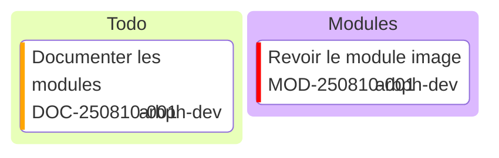

Les graphismes Mermaid sont disponibles
la documentation est accessible ici [Mermaid](https://mermaid.js.org/)
le projet open source est décrit sur [github](https://github.com/mermaid-js/mermaid) 

Pour le moment on documente et approfondi les lectures sur la librairie.
on considere les fonctions d'interaction(script) et de mise en forme(style)

# flowchart
- [flowchart](https://mermaid.js.org/syntax/flowchart.html)
- [flowchart / script](https://mermaid.js.org/syntax/flowchart.html#interaction)
- [flowchart / style](https://mermaid.js.org/syntax/flowchart.html#styling-and-classes)

# classDiagram
- [classDiagram](https://mermaid.js.org/syntax/classDiagram.html)
- [classDiagram / script](https://mermaid.js.org/syntax/classDiagram.html#interaction)
- [classDiagram / style](https://mermaid.js.org/syntax/classDiagram.html#styling)

# stateDiagram 
- [stateDiagram](https://mermaid.js.org/syntax/stateDiagram.html)
- pas de script
- [stateDiagram / style](https://mermaid.js.org/syntax/stateDiagram.html#styling-with-classdefs)

# pie 
- [pie](https://mermaid.js.org/syntax/pie.html)
- pas de script
- pas de style

# xyChart 
style via config 
- [xyChart](https://mermaid.js.org/syntax/xyChart.html)
- pas de script
- [xyChart / style](https://mermaid.js.org/syntax/xyChart.html#chart-configurations)


# sankey
- [sankey](https://mermaid.js.org/syntax/sankey.html)
tres interessant particulierment pour les bilans energie
pas de style mais a lire https://mermaid.js.org/syntax/sankey.html#links-coloring


# quadrantChart
- [quadrantChart](https://mermaid.js.org/syntax/quadrantChart.html)
- [quadrantChart / style](https://mermaid.js.org/syntax/quadrantChart.html#example-on-styling)


# radar
style via config
[radar](https://mermaid.js.org/syntax/radar.html)
[radar / style](https://mermaid.js.org/syntax/radar.html#example-on-config-and-theme)


---
# Kanban
Les **opérations** d'assemblage, de maintenance requiert la répartition et le suivi des **tâches** 

Le kanban permet de présenter les **tâches** sans les placer dans le temps
Ces méthodes d'atelier ou d'ilot de production sont employées lors de point Journalier
On présente les taches par statut, par **opérations**

On associera les colonnes de Kanban aux statuts et aux opérations

## Syntaxe


### colonne


une colonne contient des taches, elle est identité par 
- un id
- un titre

**syntaxe** 
```
columnId[Column Title]
```

### tache
une tache est affectée à une colonne et se définit par 
- un id
- un titre

on peut spécifier des métas données
- assigned: affectation de la tâche
- ticket: id de la demande
- priority: valeurs: 'Very High', 'High', 'Low' , 'Very Low'

```
id1[Documenter les modules]@{ ticket: DOC-250810-001, assigned: 'arbph-dev', priority: 'High' }
id2[Revoir le module image]@{ ticket: MOD-250810-001, assigned: 'arbph-dev', priority: 'Very High' }
```  
### exemple 

Il faut ajouter le type mermaid au bloc de code, après les 3 backstichs, pour qu'ils soit interprété

```
kanban
c1[Todo]
  id1[Documenter les modules]@{ ticket: DOC-250810-001, assigned: 'arbph-dev', priority: 'High' }
c2[Modules]
  id2[Revoir le module image]@{ ticket: MOD-250810-001, assigned: 'arbph-dev', priority: 'Very High' }
```   


---


# Gantt
Le diagramme de [Gantt](https://mermaid.js.org/syntax/gantt.html#timeline-with-comments-css-config-in-frontmatter) permet de présenter les taches dans le temps et de visualiser les opérations réalisés en parallèle

## Syntaxe
La syntaxe est tirée de l'exemple [Timeline (with comments, CSS, config in frontmatter)](https://mermaid.js.org/syntax/gantt.html#timeline-with-comments-css-config-in-frontmatter)

on découpe le fichier en 3 parties :
- configuration
- paramétrage
- données

### Configuration
La configuration taille et style se fait en YAML
```yaml
---
    title: Ignored if specified in chart
    displayMode: compact     #gantt specific setting but works at this level too
    config:
#        theme: forest
#        themeCSS: " #item36 { fill: CadetBlue } "
        themeCSS: " // YAML supports multiline strings using a newline markers: \n
            #item36 { fill: CadetBlue }       \n

            // Custom marker workaround CSS from forum (below)    \n
            rect[id^=workaround] { height: calc(100% - 50px) ; transform: translate(9px, 25px); y: 0; width: 1.5px; stroke: none; fill: red; }   \n
            text[id^=workaround] { fill: red; y: 100%; font-size: 15px;}
        "
        gantt:
            useWidth: 400
            rightPadding: 0
            topAxis: true  #false
            numberSectionStyles: 2
---
```
### paramétrage
on ajuste le graphique pour  controler son apparence : zoom, scroll
```
gantt
    title Timeline - Gantt Sampler
    dateFormat YYYY
    axisFormat %y
    %% this next line doesn't recognise 'decade' or 'year', but will silently ignore
    tickInterval 1decade
```
- title
chaîne optionnelle à afficher en haut du diagramme de Gantt pour décrire le graphique dans son ensemble. écrase le titre defini dans la configuration
- [dateFormat](https://mermaid.js.org/syntax/gantt.html#setting-dates)
- [axisFormat](https://mermaid.js.org/syntax/gantt.html#output-date-format-on-the-axis)
- [tickIntervals](https://mermaid.js.org/syntax/gantt.html#axis-ticks-v10-3-0)
Définit la résolution du diagramme; exemple : 1day , 1week ,1decade
- [weekday](https://mermaid.js.org/syntax/gantt.html#axis-ticks-v10-3-0)
exemple : monday , sunday( par defaut)
- [todayMarker](https://mermaid.js.org/syntax/gantt.html#today-marker)
controle l'affichage (valeur on , off)  et l'apparence du marqueur
- [excludes](https://mermaid.js.org/syntax/gantt.html#excludes)
permet d'exclure des 
 exemple : excludes weekends


### Données
on rapelle que les sections de gantt ,ou les colonnes de Kanban, regroupe les **tâches** des **opérations**
```
    section Issue19062
    71   :            item71, 1900, 1930
    section Issue19401
    36   :            item36, 1913, 1935
    section Issue1300
    94   :            item94, 1910, 1915
    5    :            item5,  1920, 1925
    0    : milestone, item0,  1918, 1s
    9    : vert,              1906, 1s   %% not yet official
    64   : workaround,        1923, 1s   %% custom CSS object https://github.com/mermaid-js/mermaid/issues/3250


    section Section
    A task          :a1, 2014-01-01, 30d
    Another task    :after a1, 20d

    section Section
    A task           :a1, 2014-01-01, 30d
    Another task     :a2, 2014-01-20, 25d
    Another one      :a3, 2014-02-10, 20d


    section A section
    Completed task            :done,    des1, 2014-01-06,2014-01-08
    Active task               :active,  des2, 2014-01-09, 3d
    Future task               :         des3, after des2, 5d
    Future task2              :         des4, after des3, 5d


    section Critical tasks
    Completed task in the critical line :crit, done, 2014-01-06,24h
    Implement parser and jison          :crit, done, after des1, 2d
    Create tests for parser             :crit, active, 3d
    Future task in critical line        :crit, 5d
    Create tests for renderer           :2d
    Add to mermaid                      :until isadded
    Functionality added                 :milestone, isadded, 2014-01-25, 0d

    section Documentation
    Describe gantt syntax               :active, a1, after des1, 3d
    Add gantt diagram to demo page      :after a1  , 20h
    Add another diagram to demo page    :doc1, after a1  , 48h

    section Last section
    Describe gantt syntax               :after doc1, 3d
    Add gantt diagram to demo page      :20h
    Add another diagram to demo page    :48h


```
une opération est donc défini par **section** et son IDentifiant : Issue19062 , Issue19401, Issue1300
**Les sections sont les colonnes du kanban, nous les associerons uniquement aux opérations**, les statuts seront gérés par style.

Dans les sections, que nous appelons **opérations**; les **tâches** sont par défaut séquentielles.
**Une date de début de tâche est par défaut à la date de fin de la tâche précédente.**

les **tâches** sont defini par un titre. Les :, sépare le titre de la tâche de ses métadonnées.

Les éléments de métadonnées sont séparés par une virgule, Les étiquettes valides sont:
- active
- done
- crit
- [milestone](https://mermaid.js.org/syntax/gantt.html#milestones)
Milestones differ from tasks as they represent a single instant in time and are identified by the keyword
location of the milestone is determined by the initial date for the milestone and the "duration" of the task this way: initial date+duration/2.
- [vert](https://mermaid.js.org/syntax/gantt.html#vertical-markers)
vertical lines to your Gantt chart, making it easy to highlight important dates like deadlines, events, or checkpoints

**Les étiquettes sont facultatives, mais si elles sont utilisées, elles doivent être spécifiées en premier**


