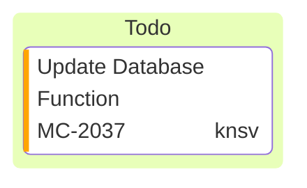

# Documentation

## Markdown

### liens
Les liens se crée en employant une syntaxe tel que:
[texte lien](../README.md)

```mermaid
kanban
todo[Todo]
  id3[Update Database Function]@{ ticket: MC-2037, assigned: 'knsv', priority: 'High' }
```   
