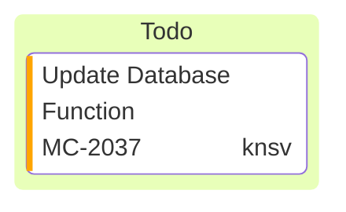

# Documentation

## Markdown


### liens
Les liens ont une syntaxe tel que : 
```
[texte lien](adresse lien)
```

#### chemin relatif 
- au dossier actuel 
```
[README](../README.md)
```
- à la racine du repository 
```
[README](/README.md)
```
exemple : [README](../README.md)
exemple : [README](/README.md)

#### chemin absolu 
```
[LARAVEL]([/README.md](https://laravel.com/)
```
exemple : [LARAVEL](https://laravel.com/)


## Mermaid
Les graphismes Mermaid sont disponibles

### Kanban



